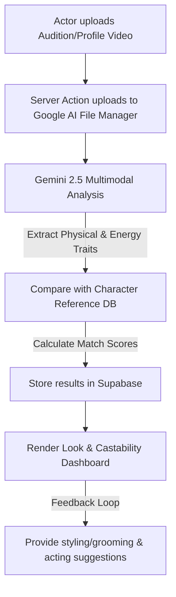

# Proposal: Look Identification & Castability Matching Feature

This document outlines the feasibility, architecture, and design for adding a **Look Identification & Castability Matching** feature to the Audition Coach application.

The core idea is to analyze an actor's visual features, body type, expression style, and overall movement energy from their uploaded performance or profile video, then cross-reference these attributes with iconic character profiles (such as *Dhalsim* from *Street Fighter*, *Wolverine* from *X-Men*, or historical figures) to assess casting fit.

---

## 1. Feasibility Assessment

This feature is **highly feasible** using the project's existing technology stack:
* **Next.js & Server Actions**: We can easily create a new Server Action that handles the look analysis trigger.
* **Gemini 2.5 Flash / Pro (Multimodal)**: Gemini natively supports video and image analysis. Since the video is already uploaded to Google AI File Manager during the audition feedback process, we can reuse the uploaded file URI or trigger a secondary analysis prompt. Gemini's visual reasoning can easily extract physical attributes, facial shape, expressions, and posture without needing specialized computer vision pipelines.
* **Supabase**: We can store character metadata (such as reference names, franchises, and descriptions) and individual actor matches in new database tables.

---

## 2. Conceptual Architecture

The feature will operate on two dimensions:
1. **Physical Attributes Extraction**: Detecting face shape, jawline, stature, posture, grooming, hair, and approximate age range.
2. **Behavioral & Energy Extraction**: Detecting movement speed, agility, intensity of gaze, facial expression variance (micro-expressions), and vocal tone.

### System Data Flow



---

## 3. Database Schema Updates

To support look matching, we propose two new tables in Supabase: `casting_characters` (the reference database of iconic roles) and `performance_look_analysis` (the results of matching the actor's performance to those roles).

```sql
-- 1. Reference Database of iconic characters and roles
CREATE TABLE casting_characters (
    id UUID PRIMARY KEY DEFAULT gen_random_uuid(),
    character_name VARCHAR(255) NOT NULL,
    media_franchise VARCHAR(255),
    role_type VARCHAR(100), -- e.g., "Agile Fighter", "Noir Detective", "Intellectual Lead"
    physical_description TEXT,
    energy_description TEXT,
    reference_image_url TEXT,
    created_at TIMESTAMP WITH TIME ZONE DEFAULT CURRENT_TIMESTAMP
);

-- 2. Analysis results mapping the performance to matched characters
CREATE TABLE performance_look_analysis (
    id UUID PRIMARY KEY DEFAULT gen_random_uuid(),
    performance_id UUID REFERENCES performance(id) ON DELETE CASCADE,
    overall_match_score INTEGER CHECK (overall_match_score BETWEEN 0 AND 100),
    detected_physical_traits JSONB, -- Array of strings e.g. ["Athletic Build", "Sharp Jawline"]
    detected_energy_traits JSONB,   -- Array of strings e.g. ["Intense Gaze", "High Agility"]
    character_matches JSONB,         -- Array of matching characters and breakdowns
    styling_advice TEXT,            -- Styling tips (grooming, wardrobe)
    posture_advice TEXT,            -- Physical performance advice
    created_at TIMESTAMP WITH TIME ZONE DEFAULT CURRENT_TIMESTAMP
);
```

> [!NOTE]
> For a quick start or MVP, we can run the matching directly inside the Gemini prompt using its **pre-trained knowledge** of famous characters (like Dhalsim, John Wick, Wolverine, etc.) and save the generated list in JSON directly into `performance_look_analysis` without maintaining a heavy reference database in Supabase initially.

---

## 4. Backend Action Implementation

A server action `analyzeCastabilityAction` will be created inside [performance.ts](file:///e:/Pro/audition-coach/apps/web/src/app/actions/performance.ts). 

### How Gemini Identifies the "Look" (Dhalsim vs. Vidyut Jammwal example)
* **Vidyut Jammwal (as reference)**: Known for extreme agility, a lean but ripped muscular build, deep-set intense eyes, sharp jawline, and disciplined/fluid physical postures derived from Kalaripayattu.
* **Dhalsim (Street Fighter)**: An ascetic yoga master, characterized by extreme physical flexibility, a lean/wiry frame, focused meditative intensity, and high-discipline movement patterns.
* **The Match**: Gemini analyzes the actor's video frame-by-frame and identifies these exact cues (e.g., highly controlled muscle movements, flexible extensions, sharp facial focus). It computes a high compatibility score (85%+) for the "Agile Ascetic / Martial Artist" archetype.

### Prompt Template

```typescript
const prompt = `
  You are an expert casting director, physical acting coach, and character designer.
  Analyze the uploaded video of the performer to evaluate their physical appearance, facial structure, expressions, body frame, and physical energy (agility, intensity, composure).
  
  TASK:
  1. Determine the actor's Visual Archetype (e.g., Action Hero, Regal Lead, Comedic Sidekick, Meditative Warrior).
  2. Extract 4-6 Visual Traits (e.g., "Sharp Cheekbones", "Athletic/Lean Frame", "Piercing Gaze").
  3. Match the actor against famous pop-culture or classical characters (e.g., Dhalsim from Street Fighter, Logan/Wolverine from Marvel, Legolas from Lord of the Rings) and explain why their physical look and energy fits.
  4. Break down the similarity across 4 key criteria (0-100):
     - Facial Structure Fit (symmetry, jawline, eye shape)
     - Physique & Stature Fit (body type, height impression, frame)
     - Energy & Vibe Fit (presence, intensity, movement speed)
     - Movement Style (fluidity, rigidity, action capacity)
  5. Provide constructive coaching on how they can alter their look (styling, grooming, posture, focus) to hit a higher match percentage for these roles.

  Respond strictly in JSON format:
  {
    "primary_archetype": "string",
    "visual_traits": ["string", "string"],
    "energy_traits": ["string", "string"],
    "matches": [
      {
        "character_name": "string",
        "franchise": "string",
        "match_percentage": number,
        "match_explanation": "string",
        "stature_score": number,
        "facial_score": number,
        "vibe_score": number
      }
    ],
    "styling_advice": "string",
    "acting_posture_advice": "string"
  }
`;
```

---

## 5. User Interface (UI) Design

To align with the Audition Coach's premium, glassmorphic dark-blue aesthetic (material layout with curated gradients), we propose adding a **"Castability & Vibe"** tab to the performance details dashboard.

### Mockup Structure & Components:

#### 1. The Archetype Badge & Visual Tag Cloud
* A large, glowing glassmorphic hero card showing the actor's primary visual archetype.
* A tag cloud of detected attributes:
  * 👤 `Athletic Frame`
  * ⚡ `High Physical Agility`
  * 👁️ `Intense Eye Focus`
  * 🪒 `Sharp Jawline`

#### 2. Character Matching Carousel (Interactive Slides)
* Displays cards for the top-3 character matches.
* For each match (e.g., **Dhalsim (Street Fighter) - 88% Match**), a radial progress bar visualizes the compatibility.
* Highlighting the reference analogy: *"You possess the physical discipline and lean, vascular frame of Vidyut Jammwal, making you a strong candidate for yoga-warrior or acrobatic character profiles like Dhalsim."*

#### 3. Match Breakdown Radar Chart
* A custom radar chart (reusing the radar view structure in `PerformanceRadarView.tsx`) measuring:
  * **Facial Alignment**: How well facial structure matches the archetype.
  * **Physique Compatibility**: Suitability of build.
  * **Energy Aura**: Vibe, intensity, and charisma match.
  * **Movement Style**: Fluidity vs. tension.

```
       [Facial Alignment]
             /   \
  [Physique] ----- [Energy Aura]
             \   /
         [Movement]
```

#### 4. "Get the Look" Custom styling panel
* Splits recommendation into two cards:
  * **Visual Styling (Grooming/Wardrobe)**: E.g., *"Growing out facial hair to define the jawline further will elevate your Noir Detective match percentage by 10%."*
  * **Physical Posture & Vibe**: E.g., *"Lowering your shoulders and relaxing your gaze during silences will help project the meditative focus required for characters like Dhalsim."*

---

## 6. Development Milestones

1. **Phase 1: DB Migration & API Action (1-2 days)**
   * Set up database tables in Supabase (or fallback to structured JSON in `performance_analysis`).
   * Write and test `analyzeCastabilityAction` with Gemini 2.5.
2. **Phase 2: Frontend Layout & Components (2 days)**
   * Create `CastabilityDashboard.tsx` containing the tags, matches, and recommendations.
   * Add a new tab trigger to `AnalysisClientLayout.tsx` for "Castability & Vibe".
3. **Phase 3: Optimization & Polish (1 day)**
   * Implement smooth Framer Motion entry transitions.
   * Fine-tune the Gemini prompts to guarantee high-accuracy physical analogies.
